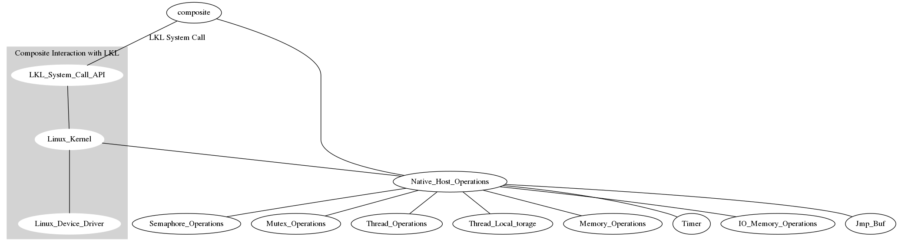

**What changes were nessecary in the project?**

I was able to sucessfully compile lkl as a library into composite. It obviously does not do anything because the host ops have not been implemented. I have changed the way that I am implementing the host ops however. Instead of having a host op file like the tests in lkl use. Instead I will be changing the api of composite to provide the host ops. To me this means that we will provide a layer of abstraction which will lead to more simplicity and hopefully less effort later on.

**Where we fell behind?**
After initally writing the semaphore host operations I realized that Operating Systems are a lot more complex with multiple threads interrupting each other all the time. I think this might take more time to test and make sure it works.

**What we'll do to catch up**
I think in order to catch up I need to have a good conceptual understanding of what I am doing, I think this will allow me to make better progress. In order to develop this conceptual understanding, I will need to read and talk to people that have a better understainding than me.
