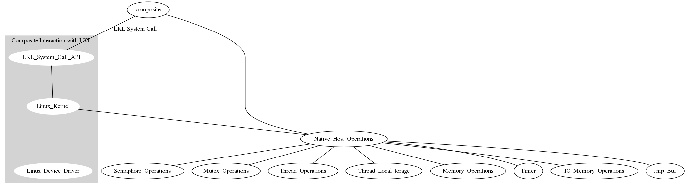

**What changes were nessecary in the project?**

I was able to sucessfully compile lkl as a library into composite. It obviously does not do anything because the host ops have not been implemented. I have changed the way that I am implementing the host ops however. Instead of having a host op file like the tests in lkl use. Instead I will be changing the api of composite to provide the host ops. To me this means that we will provide a layer of abstraction which will lead to more simplicity and hopefully less effort later on. It is impossible to just write the nessecary abstractions for the host ops that composite requires, instead I need to dive deeply into the abstraction stack in order to have a more through understanding of how to implement these operations.

**Where we fell behind?**
I have completed semaphores, however in order to really understand what is going on I need to understand the complete abstraction stack. This means I had to dive pretty deep into the API for how threads are scheduled. In order to dive deep I had to write some unit tests about how threads are handled in the composite run time branch. 

**What we'll do to catch up**
I think in order to catch up I need to have a good conceptual understanding of what I am doing. This means I need to write more unit tests as well as debug some of the composite run time branch. I might need to change my project to be more focused on showing the deep dive of this abstraction stack through a poster or a presentation. Perhaps a deep dive through the abstraction stack would be my final project. Instead of demoing LKL on composite. 
